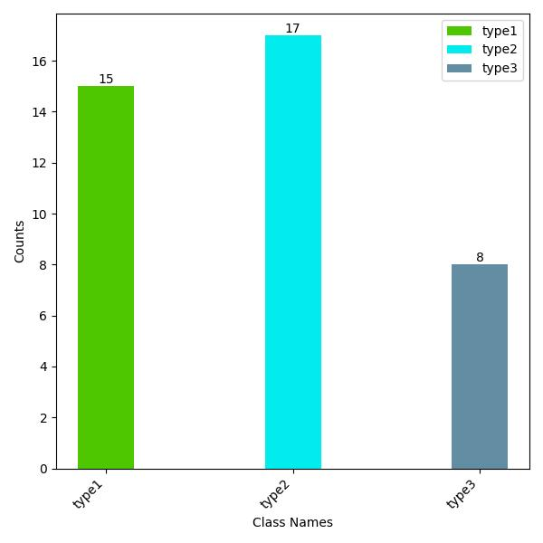
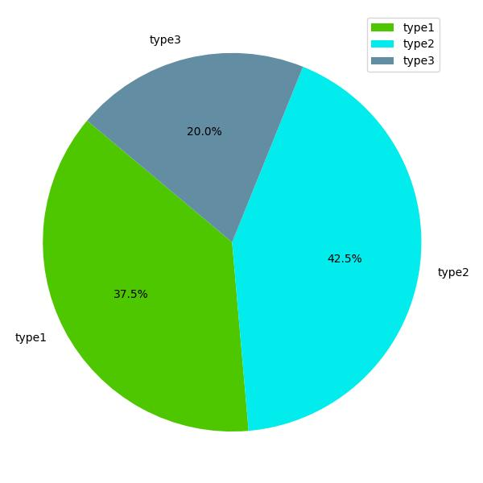

# Detection-datasets-process
目标检测和图像分割数据集处理的脚本。

## amp.py
数据扩增：
```
python amp.py --need_num 10 --source_img_path IMGPATH --source_xml_path XMLPATH --save_img_path SAVE_IMGPATH --save_xml_path SAVE_XMLPATH
```
## image_size.py
图像大小调整：
```
python image_size.py --size NUM --input INPUT_PATH --output OUTPUT_PATH
```
## xml2txt.py
VOC的xml转yolo的txt
```
python xml2txt.py --imgpath IMGPATH --xmlpath XMLPATH --txtpath TXTPATH
```

## txt2xml.py
yolo的txt转VOC的xml
```
python txt2xml.py --imgpath IMGPATH --txtpath TXTPATH --xmlpath XMLPATH
```

## label_numbers.py

统计类别数目。

    

# EndoTect数据集处理
## csv2xml.py
Kvasir肠息肉数据集中的box标注是csv格式的。  
例如：
|classes_name|xmin|ymin|xmax|ymax|
|------------|----|----|----|----|
|polyp       |85  |26  |717 |420 |

将csv格式转为coco的xml格式：
```
python csv2xml.py --imgpath IMGPATH --csvpath CSVPATH --xmlpath XMLPATH
```
## Segmentation
## mask2yolo.py
二值掩码形式转为yolo的txt归一化分割点
```
python mask2yolo.py --input MASKPATH --output TXTPATH
```
## seg_yolo2json.py
yolo的txt格式转为json的格式，将输出的json和图像放在一个位置下，便于用labelme可视化管理和修改。  
```
python seg_yolo2json.py --img IMG_AND_OUTPUT_PATH --txt TXTPATH
```
